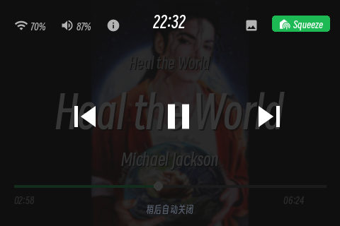
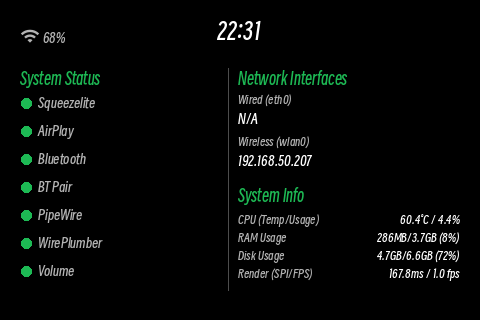

# 🎵 Ansible_RPI_TouchPlayer

[🇺🇸 English Version](README.md) | [💬 反馈与报告问题](https://github.com/holefrog/Ansible_RPI_Touch/issues)

---

## 🖼️ UI 预览 (Interface Gallery)

### 🎼 多音源无缝切换 (Audio Sources)
<p align="center">
  
  
  
</p>

### 🎛️ 触控交互与遮罩 (Interactive Overlays)
<p align="center">
  
  
  
</p>

### 📻 待机与信息屏 (Standby & Info)
<p align="center">
  
  
  
</p>

### 🎙️ 智能语音助手 (Voice Assistant)
<p align="center">
  
</p>

> 实时对话遮罩界面：右侧蓝色气泡为用户语音识别文本，左侧灰色气泡为助手回复，底部状态栏实时显示当前流程阶段（唤醒 → 录音 → 回答）。

---

## 🎯 你将获得什么(30秒速写)

将树莓派4B打造成**专业级高保真媒体播放器**，配备触摸屏UI。

✨ **核心特性:**
- **触摸屏UI** 支持盲操 (480×320, 30+ FPS)
- **多源无缝切换**: AirPlay ↔ Bluetooth ↔ Squeezelite (一键切换)
- **完全离线语音助手** 支持中文 (100% 隐私保护,零云服务)
- **硬件级隔离**: I2C + SPI 总线物理隔离,避免冲突
- **零维护部署**: 完全自动化Ansible部署 (幂等可复现)

**所需资源:**
- ⏱️ 时间: 48小时 (8h硬件组装 + 8h Ansible部署 + 32h微调)
- 💰 成本: ~¥1800 (树莓派4B + 音卡 + 触屏)
- 🛠️ 难度: 中等 (需要焊接,基础Linux命令)
- 🏆 回报: 专业级家庭媒体播放器

---

## 📑 快速导航

| 我想... | 跳转到 |
|---|---|
| **立即开始部署** | [安装与部署](#-安装与部署) |
| **了解硬件接线** | [针脚接线指南](#-针脚接线指南) |
| **自定义UI界面** | [开发与架构](#-开发与架构) |
| **配置语音助手** | [语音助手设置](#-语音助手深度剖析) |
| **解决问题** | [故障排查与FAQ](#-故障排查--faq) |
| **学习设计决策** | [架构决策记录](#-架构决策) |

---

## ✨ 核心特性

### 🎼 多源无缝音频路由 (PipeWire)

三个音频源,一台无缝播放器:

- **🎹 Squeezelite** → Logitech Media Server (无损本地音乐)
- **📱 AirPlay 2** → iPhone/iPad/Mac (系统级音频流)
- **🔵 Bluetooth A2DP** → 任何蓝牙设备 (无线简便)

**工作原理:** PipeWire自动管理混音和切换。暂停手机中的Spotify,来自LMS的音乐继续播放,无缝过渡。

### 🖥️ 高性能触摸UI

**480×320 SPI显示屏** 基于以下技术:
- **脏矩形优化**: 仅重绘变更像素 → SPI带宽减少90%+ → 30+ FPS流畅动画
- **纯轮询模式**: 无GPIO库冲突。硬件I2C-3处理触摸,与音频I2C-1隔离
- **零延迟拖拽**: 拖动进度条时实时视觉反馈(30 FPS);后端命令仅在释放时执行

**结果:** 丝滑的滚动动画,灵敏的触摸响应,专业级用户体验。

### 🔊 硬件级音频 (WM8960音卡)

**为什么选WM8960?**
- H桥放大器,支持直接扬声器连接 (无需额外功放)
- I2S硬件音频编解码 (比特完美播放)
- 双麦克风接口 (预留语音控制)

**独家驱动优化:**
官方WM8960驱动为**双麦克风HAT** (12.288 MHz晶振)设计。用于**单麦克风音卡** (24 MHz晶振)会导致时钟不匹配 → 纯白噪音。

**我们的方案:** 反向工程定制Linux驱动 `wm8960-audio-card.dtbo`。Ansible自动部署并配置ALSA路由。详见 [WM8960技术记录](documents/WM8960/RECORD.md)。

### 🎙️ 完全离线本地语音助手

**零云,100% 隐私**

- **中英文NLU**: 自然语音控制
- **零待机开销**: OpenWakeWord 检测仅占 <2% CPU
- **实时UI**: 语音/回复文字显示为聊天气泡

**技术突破:** 我们在LVA的`satellite.py`源码中注入UDP钩子,在文本数据可用的确切位置发送。这使得无需修改上游LVA协议即可实现实时转录显示。详见 [语音助手深度剖析](#-语音助手深度剖析)。

---

## 📦 开始前: 部署前检查清单

### ✅ 硬件检查清单

- [ ] **树莓派4B** (2GB+,建议4GB)
  - 其他型号(4/5/CM4)可能可用但未测试;
  
- [ ] **Waveshare WM8960音卡**
  - 单麦克风版本 (非双麦克风HAT)
  - 焊接至树莓派GPIO (或使用2.54mm针脚排以便反复使用)
  
- [ ] **3.5寸电容触摸屏 (ST7796)**
  - 480×320分辨率
  - FT6336U触摸控制器
  - 链接: https://www.waveshare.net/wiki/3.5inch_Capacitive_Touch_LCD
  
- [ ] **电源适配器**
  - 5V/3A 最小 (5V/5A 推荐)
  - USB-C 接头 (树莓派4B)
  
- [ ] **SD卡**
  - Class 10, 16GB+ (更快的卡 = 更快的启动)
  - 系统安装时会被擦除

- [ ] **焊接工具** (如直接连接音卡)
  - 电烙铁、焊锡、助焊剂
  - 吸焊器 (救急用)

### 💻 软件检查清单

**在树莓派上:**

- [ ] **系统:** Raspberry Pi OS Trixie (64-bit Lite)
  ```bash
  # 刷写后验证:
  uname -m          # 输出应为: aarch64
  lsb_release -cs   # 输出应为: trixie
  ```
  
  > **注:** Trixie 是最新版本 (2024)。

- [ ] **网络:** WiFi 或有线网已连接
  ```bash
  # 验证:
  ping 8.8.8.8
  ```

- [ ] **SSH:** 无密码密钥认证已配置
  ```bash
  # 在你的控制机 (Mac/Linux):
  ssh-copy-id -i ~/.ssh/id_rsa pi@<树莓派IP>
  
  # 验证:
  ssh -i ~/.ssh/id_rsa pi@<树莓派IP> "echo OK"
  # 输出: OK (无密码提示)
  ```

**在控制机 (Mac/Linux) 上:**

- [ ] **Ansible** 2.9+
  ```bash
  ansible --version
  # 输出: ansible [core 2.X.X] ...
  
  # 若未安装:
  pip3 install ansible
  ```

- [ ] **Python** 3.8+
  ```bash
  python3 --version
  ```

- [ ] **Git** (克隆项目)
  ```bash
  git --version
  ```

---

## 🚀 安装与部署

### 🎭 选择你的路径

#### **路径1: 完全自动化 (推荐) ⭐**

**适合:** 想要开箱即用的用户

**时间:** ~30 分钟 (外加 30 分钟服务启动等待)

**步骤:**

```bash
# 1. 在控制机上克隆项目
git clone https://github.com/holefrog/Ansible_RPI_Touch.git
cd Ansible_RPI_Touch/ansible

# 2. 配置目标树莓派
cp inventory/hosts.ini.example inventory/hosts.ini
nano inventory/hosts.ini
# 编辑: [rpi_players] 部分
#   my_player ansible_host=<树莓派IP> ansible_user=pi

# 3. 运行自动化部署
ansible-playbook -i inventory/hosts.ini site.yml

# 4. 休息喝茶 ☕ (耗时15-30分钟)
# 完成后,触屏会自动亮起
```

**成功标志:**
- 触屏显示主菜单
- 右上角显示系统信息
- 播放音乐时扬声器有声音

**本路径故障排查:**
- 部署中途失败?再运行一次playbook。Ansible幂等设计,安全重新运行。
- 权限错误?确保hosts.ini中`ansible_user=pi`有sudoers权限。
- 详细信息: `ansible-playbook -i inventory/hosts.ini site.yml -v`

---

#### **路径2: 分步手动部署 (学习向)**

**适合:** 想理解每一步的开发者

**前置条件:** 阅读 [手动设置与依赖](#-手动设置与依赖)

**步骤:**

```bash
# 1. 在树莓派上启用硬件接口
ssh pi@<树莓派IP>
sudo raspi-config
# → Interface Options → I4 SPI → 启用
# → Interface Options → I5 I2C → 启用
# → 重启

# 2. 安装系统Python库
sudo apt update && sudo apt upgrade -y
sudo apt install -y python3-rpi-lgpio python3-spidev python3-smbus2 \
                    python3-pil python3-numpy

# 3. 逐个部署模块 (而非完整site.yml)
# 现在可手动执行各role的playbook:
# - roles/system/tasks/main.yml (硬件配置)
# - roles/pipewire/tasks/main.yml (音频)
# - roles/touchscreen/tasks/main.yml (UI)
```

详细步骤见 [手动设置与依赖](#-手动设置与依赖)。

---

#### **路径3: 本地开发模式 (UI自定义)**

**适合:** 想修改UI的黑客

**前置条件:** 先完成路径1或2

**工作流:**

```bash
# SSH进入树莓派
ssh player@<树莓派IP>

# 编辑UI配置,无需重新Ansible
cd /opt/touchscreen-ui
nano ui_config.toml           # 视觉参数 (颜色、字体大小)
nano ui_components.py        # 组件定义
nano main.py                  # 主UI循环

# 重启服务以重新加载
sudo systemctl restart touchscreen.service

# 实时监看日志
sudo journalctl -u touchscreen.service -f
```

**无需重新Ansible部署!** 修改立即生效。

---

### ⏱️ 部署时间线

| 步骤 | 耗时 | 做什么 |
|------|------|--------|
| 预检 | 2 分钟 | Ansible验证连接、权限 |
| 系统更新&包 | 8 分钟 | apt upgrade、安装Python依赖 |
| 硬件配置 (dtoverlay、I2C、SPI) | 3 分钟 | 内核设备树、引脚模式 |
| **音频栈** (PipeWire、WM8960驱动) | 5 分钟 | 音频服务启动 |
| **AirPlay/蓝牙/Squeezelite** | 4 分钟 | 流媒体服务启用 |
| **触摸屏UI** | 4 分钟 | Python应用部署、systemd服务注册 |
| **语音助手** (LVA、Sherpa-ONNX) | 3 分钟 | 离线语音模型下载 (~500 MB) |
| **后置配置** (内存优化、清理) | 2 分钟 | RAM虚拟盘、sysctl调优 |
| **总计** | **~30 分钟** | ✅ 系统就绪 |

---

## 🧩 硬件设置

### 🔌 针脚接线指南

⚠️ **关键警告:** 本项目同时使用 **SPI (触屏)** 和 **I2S (音频)**。错误接线导致:
- 音频失真或无声
- 触屏闪烁或无响应
- GPIO冲突

**必须严格按下表接线。不要使用外设维基的默认接线!**

---

#### 1️⃣ WM8960音卡 (I2C-1 + I2S)

| 树莓派针脚(物理) | GPIO | 方向 | 音卡 | 用途 |
|---|---|---|---|---|
| PIN 2 或 4 | 5V | → 电源 → | **5V** | 电源输入 |
| PIN 6 或 9 | GND | → GND → | **GND** | 地 |
| **PIN 3** | **GPIO 2** | **↔ 双向 ↔** | **SDA** | I2C-1 数据 (音频控制) |
| **PIN 5** | **GPIO 3** | **↔ 双向 ↔** | **SCL** | I2C-1 时钟 (音频控制) |
| PIN 12 | GPIO 18 | → TX → | **CLK** | I2S 位时钟 (**⚠️ 禁止触碰**) |
| PIN 35 | GPIO 19 | → TX → | **LRCLK** | I2S L/R帧时钟 |
| PIN 40 | GPIO 21 | → TX → | **DAC (RXSDA)** | 播放音频数据 |
| PIN 38 | GPIO 20 | ← RX ← | **ADC (TXSDA)** | 录音(麦克风) - 保留用于驱动自检 |

**关键注意:**
- GPIO 18 是 **I2S 位时钟** — 极其敏感,抢占会导致失真
- 即使不录音也保留GPIO 20;Linux驱动需要它初始化
- 电源必须 **稳定5V** (噪声电源 → 音频抖动)

---

#### 2️⃣ 3.5寸电容触摸屏 (SPI0 + I2C-3 + PWM)

| 屏幕针脚 | 信号 | 树莓派物理针脚 | GPIO | 用途 | 说明 |
|---|---|---|---|---|---|
| 1 | VCC | PIN 2 | 5V | 电源 | 用5V,非3.3V |
| 2 | 3V3 | **NC** | — | 未使用 | — |
| 3 | GND | PIN 6 | GND | 地 | — |
| 4 | MISO | PIN 21 | GPIO 9 | SPI数据入 | 可选(屏单向) |
| 5 | MOSI | PIN 19 | GPIO 10 | SPI数据出 | 像素数据到屏 |
| 6 | SCLK | PIN 23 | GPIO 11 | SPI时钟 | 像素时钟 |
| 7 | SD_CS | **NC** | — | SD卡CS | 未使用 |
| **8** | **LCD_CS** | **PIN 24** | **GPIO 8** | **SPI片选** | **必须用GPIO 8** |
| **9** | **LCD_DC** | **PIN 22** | **GPIO 25** | **数据/命令切换** | 控制SPI数据包类型 |
| **10** | **LCD_RST** | **PIN 13** | **GPIO 27** | **屏幕复位** | 启动时脉冲 |
| **11** | **LCD_BL** | **PIN 33** | **GPIO 13** | **背光PWM** | **硬件PWM1** (避免I2S干扰) |
| **12** | **TP_SDA** | **PIN 7** | **GPIO 4** | **I2C-3 数据** | 触摸 (与音频I2C-1隔离) |
| **13** | **TP_SCL** | **PIN 29** | **GPIO 5** | **I2C-3 时钟** | 触摸 (与音频I2C-1隔离) |
| 14 | TP_INT | **NC** | — | ❌ **未使用** | 纯轮询模式 |
| **15** | **TP_RST** | **PIN 11** | **GPIO 17** | **触摸复位** | 初始化信号 |

**关键注意:**
- SPI0 是树莓派4B上仅有的SPI总线;无替代方案
- I2C-3 **物理隔离** 于 I2C-1 (音频控制) — 无冲突
- PWM1 (GPIO 13) 特意选择以避免 I2S 时钟 (GPIO 18) 冲突
- 触摸使用 **纯轮询** (无中断针脚) → 解决资源竞争

---

### 💡 背光闪烁&硬件PWM设置

#### 为什么背光会闪烁?

软件PWM (GPIO比特操纵) 依赖CPU线程生成方波。高系统负载下,调度延迟会造成毫秒级延迟 → 整个PWM脉冲丢失 → 低亮度时可见闪烁。

**解决方案:** 启用树莓派原生 **硬件PWM** (专用硬件计数器)。

#### 如何启用硬件PWM

编辑 `/boot/firmware/config.txt`:

```ini
# 为背光启用硬件PWM (GPIO 13, PWM1)
dtoverlay=pwm-2chan,pin=12,func=4,pin2=13,func2=4
```

**⚠️ 关键:** `pwm-2chan` 强制GPIO 12和13都进入PWM模式。若GPIO 12被其他硬件占用 (如I2S时钟),会破坏它们。

**解决:** Ansible验证I2S时钟在GPIO 18 (非12),所以无冲突。

#### 验证硬件PWM是否激活

```bash
ls -la /sys/class/pwm/pwmchip0/pwm1/

# 期望输出:
# duty_cycle  enable  period  polarity  uevent

# 检查GPIO 13模式:
pinctrl get 13
# 期望: a0, PWM
```

---

## 🧑‍💻 开发与架构

### 架构概览

```
┌─────────────────────────────────────────────────────┐
│              Ansible Role (部署)                     │
├─────────────────────────────────────────────────────┤
│ system        → 硬件隔离 (dtoverlay, I2C)            │
│ pipewire      → 音频引擎 & 多源混音                  │
│ airplay       → AirPlay接收器 (shairport-sync)       │
│ bluetooth     → 蓝牙A2DP (自动配对)                  │
│ squeezelite   → LMS客户端 (Logitech Media Server)   │
│ volume        → 主音量控制服务                       │
│ touchscreen   → Python UI + 屏驱动                   │
│ voiceassistant→ LVA + 离线语音识别                  │
└─────────────────────────────────────────────────────┘
         ↓
┌─────────────────────────────────────────────────────┐
│          Python应用层                                 │
├─────────────────────────────────────────────────────┤
│ main.py             → 入口点、服务循环               │
│ ui_manager.py       → 渲染引擎 (脏矩形)              │
│ state_manager.py    → 后台状态轮询                  │
│ input_controller.py → 触摸坐标映射                  │
│ assistant_listener.py → 语音UDP事件处理              │
└─────────────────────────────────────────────────────┘
         ↓
┌─────────────────────────────────────────────────────┐
│      硬件I/O (纯SPI + I2C)                            │
├─────────────────────────────────────────────────────┤
│ st7796.py        → ST7796 SPI屏驱动                  │
│ ft6336u.py       → FT6336U I2C触摸控制器             │
│ hardware_display.py → 显示背光PWM控制                │
└─────────────────────────────────────────────────────┘
```

### 开发工作流

#### 1. **修改配置 (无需重启)**

编辑 `ui_config.toml`:
```toml
[screen]
width = 480
height = 320
spi_speed = 24000000  # 24 MHz

[ui]
main_bg_color = "#000000"
font_size = 24
```

改动在`main.py`重新加载后立即生效。

#### 2. **修改UI布局 (Systemd重启)**

编辑 `main.py`、`ui_screen_main.py` 或 `ui_components.py`:
```bash
ssh player@<树莓派IP>
cd /opt/touchscreen-ui
nano ui_screen_main.py
sudo systemctl restart touchscreen.service
```

查看日志:
```bash
sudo journalctl -u touchscreen.service -f
```

#### 3. **修改音频路由 (PipeWire重启)**

编辑 `/etc/pipewire/pipewire.conf` 或 `/etc/alsa/asound.conf`:
```bash
sudo systemctl restart pipewire.service
```

#### 4. **运行本地测试脚本**

```bash
# 在树莓派上:
python3 /opt/touchscreen-ui/test_screen.py
# 显示渐变色、测量SPI时序、测试触摸
```

---

### 性能优化技术

#### 1. **脏矩形算法**

问题: 完整SPI屏刷新 (480×320 RGB565) 在24MHz只有~7 FPS。

解决: **脏矩形** — 仅重绘变更像素。

```python
from PIL import ImageChops

frame_prev = Image.new('RGB', (480, 320))
frame_curr = render_ui()

# 找出变化的最小矩形
diff = ImageChops.difference(frame_prev, frame_curr)
bbox = diff.getbbox()

if bbox:
    # 仅发送变化的矩形到SPI
    spi_write_rect(frame_curr, bbox)
    
frame_prev = frame_curr
```

**结果:** 带宽减少90%+ → **30+ FPS** 流畅动画。

#### 2. **模块解耦**

原始: 500行单体 `main.py`

重构为:
- `state_manager.py` — 后台状态轮询 (线程运行)
- `input_controller.py` — 触摸坐标映射 (无UI阻塞)
- `ui_manager.py` — 渲染管道 (脏矩形管理)
- `main.py` — 胶合层、服务循环

**优势:** 修改触摸处理不影响渲染;可测试单元。

#### 3. **RAM虚拟盘零延迟I/O**

问题: SD卡I/O阻塞 → 掉帧。

解决: 挂载 `/tmp` 和 `/var/tmp` 为 `tmpfs` (RAM虚拟盘)。

```bash
# Ansible自动配置:
mount | grep tmpfs
# /dev/shm on /tmp type tmpfs
# /dev/shm on /var/tmp type tmpfs
```

所有临时文件 (语音块、缓存) 存在RAM中 → 无SD卡I/O抖动。

#### 4. **内核Sysctl调优**

Ansible应用:
```
vm.vfs_cache_pressure = 50    # 积极缓存inode (图标加载更快)
vm.dirty_ratio = 20           # 在RAM中缓冲磁盘写
vm.dirty_background_ratio = 10
swappiness = 0                # 禁用交换 (纯内存优先)
```

---

### 调试技巧

#### **屏幕截图** (内存式)

由于UI直接运行在SPI硬件上 (无X11/Wayland),使用内置信号处理器:

```bash
# 在控制机:
ssh player@<树莓派IP> "systemctl --user kill -s SIGUSR1 touchscreen"

# PNG截图写到树莓派的/tmp/:
scp player@<树莓派IP>:/tmp/screenshot_*.png ./
```

#### **实时日志流**

```bash
ssh player@<树莓派IP> "sudo journalctl -u touchscreen.service -f"
```

#### **SPI性能分析**

```python
import time
from st7796 import ST7796

display = ST7796()
t0 = time.time()
display.write_rect(frame, (0, 0, 480, 320))  # 全屏
print(f"SPI传输: {(time.time() - t0) * 1000:.1f} ms")
# 期望: 全屏 24 MHz 约50-60 ms
```

---

## 🎙️ 语音助手深度剖析

### 系统架构

```
麦克风 (via PipeWire)
    ↓
LVA守护进程 (Linux Voice Assistant)
    ├─ OpenWakeWord检测 ("ok nabu")
    │       ↓
    │   [修补的satellite.py]
    │       → UDP port 10701 {"event": "awake"}
    │
    ├─ 暂停播放 (释放CPU用于推理)
    │
    ├─ Wyoming STT集成 → Sherpa-ONNX (port 10300)
    │       ↓
    │   转录: "关闭小米台灯" (关闭Xiaomi灯)
    │       → UDP {"event": "transcript", "text": "..."}
    │
    ├─ Home Assistant意图匹配
    │       ↓
    │   匹配: device=lamp, action=off
    │
    ├─ Wyoming TTS集成 → Sherpa-ONNX (port 10200)
    │       ↓
    │   回复: "小米台灯已关闭" (Xiaomi灯已关闭)
    │       → UDP {"event": "synthesize", "text": "..."}
    │
    └─ 音频播放 via PipeWire
            ↓
        扬声器输出

              ↓↓↓
    [assistant_listener.py] (port 10701)
              ↓
    StateManager → UIManager
              ↓
    触屏实时聊天气泡覆盖层
```

### 技术突破: UDP修补

**问题:** LVA提供回调脚本但**无文本payload**:
```bash
# 标准LVA回调:
LVA_ON_WAKE_WORD=""              # ✗ 空
LVA_ON_STT_END=""                # ✗ 无转录
LVA_ON_TTS_START=""              # ✗ 无回复文本
```

**无法在没有文本的情况下显示对话!**

**我们的解决方案:** 修补LVA的`satellite.py`源码,在文本数据可用的推理管道确切点注入UDP发送:

```python
# 在satellite.py中 (修补)
def on_transcript(text):
    # ... 推理逻辑 ...
    socket.sendto(json.dumps({
        "event": "transcript",
        "text": text  # ← 文本数据在此注入
    }).encode(), ("127.0.0.1", 10701))
```

**优势:**
1. **无协议变更** — LVA API不变
2. **实时文本** — 显示立即进行
3. **版本控制** — 修补的`satellite.py`在`roles/voiceassistant/files/`

### 为什么不选Wyoming?

我们评估了`wyoming-satellite` (主流HA集成) 并拒绝了:

| 问题 | 根本原因 | 严重性 |
|---|---|---|
| 2秒断连循环 | 协议ping/pong竞态条件 | **致命** |
| Whisper幻觉 | ARM上自回归解码器在沉默时死循环 | **致命** |
| Piper中文TTS无声 | 缺少`unicode_rbnf`音素化 | **阻塞** |
| 项目存档 | `wyoming-satellite` 2026年1月停止维护 | **无未来** |

**LVA是稳定替代方案。**

### 语音助手UI

UI覆盖层 (聊天气泡) 是 **独立Python线程** 由`assistant_listener.py`管理:

```python
# 在StateManager后台线程中运行
listener = AssistantListener(port=10701)

while True:
    event = listener.recv()  # 阻塞UDP接收
    
    if event["event"] == "transcript":
        state.assistant_messages.append({
            "role": "user",
            "text": event["text"],
            "timestamp": time.time()
        })
    elif event["event"] == "synthesize":
        state.assistant_messages.append({
            "role": "assistant",
            "text": event["text"]
        })
    
    # 渲染线程拾取state.assistant_messages
    # 并实时绘制聊天气泡
```

**关键洞察:** UI更新与推理**解耦**。TTS生成不阻塞渲染。

---

## ⚙️ 手动设置与依赖

如果跳过Ansible手动设置:

### 1. 启用硬件接口

```bash
sudo raspi-config
# Interface Options → I4 SPI → 启用
# Interface Options → I5 I2C → 启用
# Advanced Options → Hardware I2C → 启用 I2C-3
# 重启

# 验证:
ls /dev/spi*   # 应看到: /dev/spidev0.0
i2cdetect -l   # 应看到: i2c-1, i2c-3
```

### 2. 安装系统依赖

```bash
sudo apt update
sudo apt upgrade -y
sudo apt install -y \
    python3-rpi-lgpio \
    python3-spidev \
    python3-smbus2 \
    python3-pil \
    python3-numpy \
    python3-gpiozero \
    libraspberrypi-bin \
    pulseaudio \
    alsa-utils
```

### 3. 创建虚拟环境 (PEP 668兼容)

```bash
python3 -m venv /opt/touchscreen-venv --system-site-packages
source /opt/touchscreen-venv/bin/activate
pip install luma.lcd requests numpy
```

### 4. 部署WM8960驱动

```bash
# 复制自定义dtbo:
sudo cp roles/system/files/wm8960-audio-card.dts /boot/firmware/overlays/
sudo dtc -@ -I dts -O dtb -o /boot/firmware/overlays/wm8960-audio-card.dtbo \
         /boot/firmware/overlays/wm8960-audio-card.dts

# 在 /boot/firmware/config.txt 中启用:
dtoverlay=wm8960-audio-card

# 重启并验证:
arecord -l  # 应列出WM8960
aplay -l    # 应列出WM8960
```

### 5. 注册Systemd服务

```bash
# 用于触屏:
sudo cp roles/touchscreen/templates/ts.service.j2 /etc/systemd/system/touchscreen.service
sudo systemctl daemon-reload
sudo systemctl enable --now touchscreen.service

# 用于语音助手 (如需):
sudo cp roles/voiceassistant/templates/lva.service.j2 /etc/systemd/system/lva.service
sudo systemctl enable --now lva.service
```

---

## ❓ 故障排查 & FAQ

### **部署问题**

**Q: 部署时出现 `Permission denied (publickey)`?**

A: SSH密钥认证未配置。修复:
```bash
# 在控制机:
ssh-copy-id -i ~/.ssh/id_rsa pi@<树莓派IP>
# 输入密码: raspberry (默认)

# 验证:
ssh -i ~/.ssh/id_rsa pi@<树莓派IP> "whoami"
# 输出: pi
```

**Q: Playbook运行中途失败。可以重新运行吗?**

A: 可以!Ansible playbook**幂等设计**。重新运行是安全的:
```bash
ansible-playbook -i inventory/hosts.ini site.yml
# 会跳过已完成任务
# 从失败点恢复
```

**Q: 如何检查部署进度?**

A: 实时监看日志:
```bash
# 在树莓派:
ssh player@<树莓派IP> "sudo journalctl -u touchscreen.service -f"
```

---

### **硬件问题**

**Q: 触屏黑屏/不亮?**

A:
1. **检查SPI是否启用:**
   ```bash
   ls /dev/spidev0.0
   # 应存在,否则运行 raspi-config → I4 SPI
   ```

2. **检查针脚连接:** 验证物理电线与接线表匹配。常见错误:
   - LCD_CS (PIN 24) → GPIO 8? (非GPIO 7)
   - LCD_DC (PIN 22) → GPIO 25?

3. **运行诊断:**
   ```bash
   ssh player@<树莓派IP>
   cd /opt/touchscreen-ui
   python3 test_screen.py
   # 显示色条、触摸灵敏度测试
   ```

4. **检查背光GPIO:**
   ```bash
   # 应在GPIO 13看到PWM输出:
   ls /sys/class/pwm/pwmchip0/pwm1/
   # 如缺失,/boot/firmware/config.txt 背光配置有误
   ```

---

**Q: WM8960有噪音/无声?**

A:
1. **验证音频到达WM8960:**
   ```bash
   aplay -l
   # 应列出: card 1: audio [WM8960 Audio Board]
   
   speaker-test -D plughw:1 -c 2 -t wav
   # 听测试音
   ```

2. **检查I2C控制:**
   ```bash
   i2cdetect -y 1
   # 应看到: 1a (WM8960控制地址)
   ```

3. **验证I2S时钟:**
   ```bash
   sudo dmesg | grep wm8960
   # 应显示时钟率: 12.288 MHz (非24 MHz,因为时钟倍增)
   ```

4. **检查ALSA混音器:**
   ```bash
   alsamixer -c 1
   # 增加Output播放音量
   ```

---

### **软件问题**

**Q: Python ImportError: No module named 'spidev'?**

A: 虚拟环境未激活。修复:
```bash
source /opt/touchscreen-venv/bin/activate
python3 -c "import spidev; print('OK')"
```

或全局安装 (PEP 668系统不推荐):
```bash
pip3 install --break-system-packages spidev
```

---

**Q: 语音助手无响应?**

A:
1. **检查LVA是否运行:**
   ```bash
   sudo systemctl status lva.service
   ```

2. **检查麦克风输入:**
   ```bash
   arecord -D plughw:1 -f S16_LE -r 16000 - | aplay
   # 录音然后回放
   ```

3. **检查UDP监听:**
   ```bash
   ss -ulnp | grep 10701
   # 应看到Python进程监听port 10701
   ```

4. **查看日志:**
   ```bash
   sudo journalctl -u lva.service -n 50
   ```

---

### **性能问题**

**Q: UI卡顿/触屏响应慢?**

A:
1. **检查SPI频率:**
   ```bash
   cat /opt/touchscreen-ui/ts.ini | grep spi_speed
   # 应为: 24000000 (24 MHz)
   ```

2. **检查干扰:**
   ```bash
   # 降低SPI速度测试:
   nano /opt/touchscreen-ui/ts.ini
   # spi_speed = 12000000  (试试12 MHz)
   sudo systemctl restart touchscreen.service
   ```

3. **检查CPU负载:**
   ```bash
   top
   # 若python3 > 50%,UI循环被抢占
   # 在main.py中增加调度优先级
   ```

---

### **FAQ: 常见问题**

**Q: 支持树莓派5吗?**

A: 未测试。树莓派5有不同GPIO映射和更快CPU。欢迎测试并反馈!

**Q: 如何更新触屏UI?**

A: 从GitHub拉取最新,重启服务:
```bash
ssh player@<树莓派IP>
cd /opt/touchscreen-ui
git pull origin main
sudo systemctl restart touchscreen.service
```

**Q: 如何备份配置?**

A: 所有状态在配置文件中:
```bash
scp -r player@<树莓派IP>:/opt/touchscreen-ui/ui_config.toml ./
# 稍后恢复: scp ui_config.toml player@<树莓派IP>:/opt/touchscreen-ui/
```

**Q: 如何添加新的音频源 (如Spotify)?**

A: 修改PipeWire配置:
```bash
ssh player@<树莓派IP>
sudo nano /etc/pipewire/pipewire.conf
# 添加新源输入规则
sudo systemctl restart pipewire.service
```

详见 [PipeWire文档](https://docs.pipewire.org/)。

---

## 🏛️ 架构决策

### ADR-001: Ansible vs Docker vs Shell脚本

**状态:** 已批准

**背景:** 树莓派媒体播放器需硬件接口管理 (dtoverlay、I2C/SPI配置)。

**决策:** 使用Ansible playbooks做基础设施即代码。

**理由:**
- **脚本:** 硬件设备树 (`dtoverlay`) 难以版本控制和重新部署
- **Docker:** 音频/I2C硬件访问增加复杂度;隔离开销抵消资源节省
- **Ansible:** 声明式、幂等、RPi模块社区支持好

**权衡:** 更陡学习曲线 vs 长期可维护性。**可维护性胜。**

---

### ADR-002: PipeWire vs PulseAudio vs ALSA

**状态:** 已批准

**背景:** 三个音频源 (AirPlay、蓝牙、Squeezelite) 必须无缝混音。

**决策:** 使用PipeWire作为核心音频路由器。

**理由:**
- **ALSA:** 低层;手动混音增加复杂度,蓝牙集成差
- **PulseAudio:** 可靠但多源配置复杂,延迟更高
- **PipeWire:** 现代架构(2022+),原生多源处理,低延迟

**权衡:** PipeWire更新(Trixie独占) vs 久经考验的PA。**性能胜。**

---

### ADR-003: LVA vs wyoming-satellite

**状态:** 已批准 (Wyoming被拒)

**背景:** Home Assistant智能家居集成的语音控制。

**决策:** 使用LVA (Linux Voice Assistant) + Sherpa-ONNX 进行离线语音识别。

**理由:**
- **wyoming-satellite:** 协议竞态条件(ping/pong)、Whisper在ARM幻觉、项目已存档
- **LVA:** 稳定连接(ESPHome原生API)、积极维护(OHF)、Sherpa-ONNX有ONNX量化

**权衡:** 代码修补(入侵式) vs 稳定性。**稳定性胜。**

详见 [Wyoming评估文档](documents/VOICE_ASSISTANT_EVALUATION.md)。

---

### ADR-004: 轮询 vs 中断驱动触摸

**状态:** 已批准

**背景:** FT6336U触摸控制器使用I2C接口。

**决策:** 纯轮询模式 (无中断针脚)。

**理由:**
- **中断模式:** 需INT针脚 → GPIO冲突;高速UI中竞态条件
- **轮询模式:** CPU成本最小 (smbus2 I2C-3隔离),延迟可预测,调试更简单

**权衡:** ~1-2% CPU开销 vs GPIO资源竞争。**简洁性胜。**

---

## 🤝 贡献

欢迎贡献!详见 [CONTRIBUTING.md](CONTRIBUTING.md) 获取代码风格、测试和PR流程。

---

## 📄 许可证

MIT许可证 — 自由修改、分发和商业使用。详见 [LICENSE](LICENSE)。

---

## 🙏 致谢

- **Waveshare** 卓越硬件与文档
- **Home Assistant** 社区 LVA + Sherpa-ONNX集成
- **Linux内核** 维护者 设备树覆盖支持

**用 ❤️ 为制造商社区打造。**

---

## 📚 进阶阅读

- [WM8960技术深度剖析](documents/WM8960/RECORD.md)
- [语音助手架构](VOICE_ASSISTANT_HA.md)
- [蓝牙故障排查指南](documents/BLUETOOTH_TIPS.md)
- [树莓派引脚参考](https://pinout.xyz/)
- [PipeWire文档](https://docs.pipewire.org/)

---

## 📞 获取帮助

- **Issues:** [GitHub Issues](https://github.com/holefrog/Ansible_RPI_Touch/issues)
- **讨论:** [GitHub Discussions](https://github.com/holefrog/Ansible_RPI_Touch/discussions)
- **邮件:** 项目邮箱 (若提供)

**祝你黑客愉快! 🚀**
